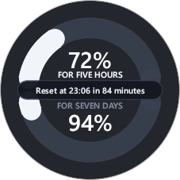
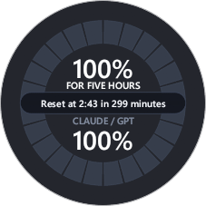
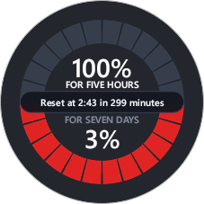

# Tokpaek

<p align="left">
  <a href="https://github.com/Ilardar/Tokpaek/releases/latest"></a>
  
  <a href="LICENSE"></a>
  
</p>

**English** | [Русский](README.md)

**Tokpaek** is a sleek, lightweight circular quota widget for **Google Antigravity**, **Claude**, and **Codex**. It displays real-time quota usage and reset countdowns floating directly over your IDE, application, or terminal workspace, with one-click switching between sources.

---

### Preview

| Continuous Arc (5 hours) | Continuous Arc (7 days) | Segmented Scale | Quota Warning Alert |
| :---: | :---: | :---: | :---: |
|  |  |  |  |
| *5h session reset* | *7-day limit reset* | *Cell / pool mode* | *Red alert when < 5%* |

---

## Features

* **Multiple Data Sources — Claude, Codex, and Antigravity:**
  * Pick a source from the right-click context menu or the tray menu.
  * **Auto** mode follows the active window; pin a specific source to stop auto-switching.
* **Dual-Arc Gauge:**
  * **Top arc:** 5-hour rolling session window (primary model quota).
  * **Bottom arc:** 7-day weekly limit or shared model quota pool (configurable).
* **Interactive Reset Countdown:**
  * The center pill shows the exact reset time and live countdown (minutes or days/hours).
  * Single-click the center pill to instantly toggle between the 5-hour and 7-day timers.
* **Customization & Themes:**
  * **4 color palettes:** *Gradient* (smooth green → yellow → red), *Traffic Light* (three discrete thirds), *Cyan*, and *Monochrome*.
  * **3 scale styles:** Continuous smooth arc, 12-segment clock scale, or 10-segment decimal scale.
  * **Visual alert:** Segments turn red automatically when quota drops below 5%.
* **Smart Focus:**
  * Automatically hides when you switch to other tasks (browser, chats) and reappears whenever Antigravity is active.
  * **"Always on Top"** toggle for users who prefer continuous visibility.
* **Effortless Window Controls:**
  * Drag freely anywhere on the screen by holding LMB on the center.
  * Smooth resize by dragging the outer circular border, just like a standard window.
  * Window size, position, and opacity are saved automatically.
  * Zero taskbar clutter — unobtrusive system tray icon and right-click context menu.

---

## Supported Sources

Tokpaek monitors active AI environments on your machine:

* **Antigravity 2.0** — desktop application;
* **Antigravity IDE** — developer environment and local language server;
* **Antigravity CLI (`agy`)** — command-line interface running in terminals;
* **Claude Desktop / Claude Code / Claude CLI** — shared Anthropic account (5-hour and weekly windows);
* **Codex / ChatGPT Desktop** — OpenAI account (primary and weekly windows).

---

## Controls Reference

| Action | How to perform |
|---|---|
| **Move widget** | Hold **LMB** in the center and drag |
| **Resize** | Drag the **outer edge** of the ring with your mouse cursor |
| **Toggle countdown (5h / 7d)** | Click **LMB on the center pill** |
| **Switch data source** | RMB → **Data source** (Auto / Claude / Codex / Antigravity) |
| **Open Settings / Menu** | Click **RMB** on the widget or system tray icon |
| **Reset position ("Home")** | RMB → **Home** (moves to top-left screen corner) |

---

## Privacy & Security

* **Zero telemetry:** No analytics, tracking pixels, or diagnostic telemetry collection.
* **Zero advertisements:** No banners, affiliate links, or promotional popups.
* **Official endpoints only:** Antigravity is read from the local server on `127.0.0.1`; Claude and Codex query the official Anthropic and OpenAI APIs. No intermediary or third-party servers.
* **Local credentials:** Tokens are read locally (Claude Desktop profile, `~/.codex/auth.json`, Antigravity process descriptors). Nothing is written to system files, and no data is sent anywhere except the official API of the selected source.
* **Configuration:** Stored locally in `%APPDATA%\Tokpaek\settings.json`.

---

## Data Source

| Provider | Data Source |
|---|---|
| **Antigravity** | Local Antigravity language server — uses the exact same internal RPC endpoint queried by the IDE's built-in usage panel |
| **Claude** | Official Anthropic API (`api.anthropic.com`) using the token from the local Claude Desktop profile; also covers Claude Code / CLI |
| **Codex** | Official OpenAI API (`chatgpt.com`) using the token from `~/.codex/auth.json` |

When the selected source is unavailable (the app is closed or no token is found), the widget stays in standby and resumes automatically once the source is back.

---

## Installation

### Option 1. Installer (Recommended)
Download **[Tokpaek-Setup.exe](https://github.com/Ilardar/Tokpaek/releases/latest/download/Tokpaek-Setup.exe)** from the [Releases](https://github.com/Ilardar/Tokpaek/releases) page:
* Installs into your user profile (`%LOCALAPPDATA%`), requiring no administrator privileges.
* Optional system autostart toggle during installation.

### Option 2. Portable
Download **`tokpaek.exe`** from the latest release — no installation required.

---

## Requirements

* **Operating System:** Windows 10 / 11, x64.
* **Data source:** a running environment for at least one source — Antigravity (app/IDE/CLI), Claude Desktop (or Claude Code/CLI), or Codex CLI.

---

## Building from Source

Requires the [Rust toolchain](https://rustup.rs/):

```bash
cargo build --release
```

The output binary is located at `target/release/tokpaek.exe`.

To build the installer package (requires [Inno Setup 6](https://jrsoftware.org/isdl.php)):

```powershell
powershell -ExecutionPolicy Bypass -File tools\build-installer.ps1
```

---

## Credits

Based on the [Quotty](https://github.com/confeden/Quotty) project — special thanks to [@confeden](https://github.com/confeden).
