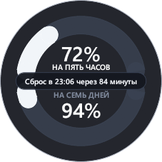
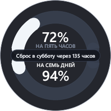
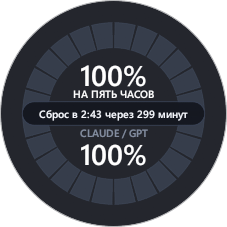
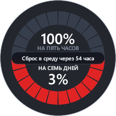

# Токпаёк (Tokpaek)

<p align="left">
  <a href="https://github.com/Ilardar/Tokpaek/releases/latest"></a>
  
  <a href="LICENSE"></a>
  
</p>

[English](README.en.md) | **Русский**

**Токпаёк** — компактный круглый виджет квот для **Google Antigravity**, **Claude** и **Codex**. Отображает текущий расход лимитов и таймер сброса прямо поверх окна рабочей среды (IDE, приложения или терминала) и переключается между источниками одним кликом.

---

### Внешний вид

| Сплошная дуга (5 часов) | Сплошная дуга (7 дней) | Шкала с делениями | Предупреждение об исчерпании |
| :---: | :---: | :---: | :---: |
|  |  |  |  |
| *Сброс 5-часовой сессии* | *Сброс недельного лимита* | *Отображение ячейками* | *Красный индикатор при < 5%* |

---

## Возможности

* **Несколько источников данных — Claude, Codex и Antigravity:**
  * Выбор источника в контекстном меню (ПКМ) или меню трея.
  * Режим **«Авто»** следует за активным окном; источник можно закрепить, чтобы виджет не переключался сам.
* **Двухдуговая шкала расхода:**
  * **Верхняя дуга** — скользящее 5-часовое окно сессии (основной рабочий лимит моделей).
  * **Нижняя дуга** — недельный лимит (7 дней) или общий пул моделей (настраивается).
* **Интерактивный таймер сброса:**
  * В центральной плашке выводится точное время сброса и обратный отсчёт (минуты или дни/часы).
  * Переключение между 5-часовым и недельным таймером осуществляется в один клик по плашке.
* **Гибкая настройка оформления:**
  * **4 цветовые палитры:** *Градиент* (плавный переход зелёный → жёлтый → красный), *Светофор* (три зоны), *Бирюзовая* и *Монохромная*.
  * **3 формата шкалы:** сплошная гладкая дуга, 12 делений (часовая) или 10 делений (десятичная).
  * **Цветовое предупреждение:** автоматическая подсветка красным цветом при приближении к исчерпанию лимита (< 5%).
* **Режим «Умный фокус» (Smart Focus):**
  * Виджет автоматически прячется, когда вы работаете в других программах (браузере, мессенджерах), и показывается только при активном окне Antigravity.
  * Опция **«Поверх всех окон»** для тех, кому счётчик нужен на экране непрерывно.
* **Удобное управление окном:**
  * Перетаскивание мышью (ЛКМ за центр) в любую точку экрана.
  * Плавное изменение размера — просто потяните за внешний край круга курсором, как обычное окно.
  * Позиция, размер и прозрачность сохраняются автоматически.
  * Не занимает места на панели задач, управляется через контекстное меню (ПКМ) и системный трей.

---

## Поддерживаемые источники

Виджет автоматически отслеживает активные окружения:

* **Antigravity 2.0** — десктопное приложение;
* **Antigravity IDE** — среда разработки и локальный языковой сервер;
* **Antigravity CLI (`agy`)** — работа в консоли и терминале;
* **Claude Desktop / Claude Code / Claude CLI** — общий аккаунт Anthropic (5-часовое и недельное окно);
* **Codex / ChatGPT Desktop** — аккаунт OpenAI (основное и недельное окно).

---

## Как пользоваться

| Действие | Способ |
|---|---|
| **Переместить виджет** | Зажать **ЛКМ** в центре круга и перетащить |
| **Изменить размер** | Потянуть курсором мыши за **внешний край** круга |
| **Переключить таймер (5ч / 7д)** | Кликнуть **ЛКМ по центральной плашке** |
| **Переключить источник** | ПКМ → **«Источник данных»** (Авто / Claude / Codex / Antigravity) |
| **Открыть настройки** | Кликнуть **ПКМ** по виджету или по иконке в трее |
| **Вернуть в угол («Домой»)** | ПКМ → пункт меню **«Домой»** (левый верхний угол экрана) |

---

## Приватность и безопасность

* **Нет телеметрии:** Никаких аналитических систем, счётчиков посещений и сбора данных.
* **Нет рекламы:** Никаких баннеров, партнёрских ссылок и уведомлений.
* **Только официальные серверы:** Antigravity читается с локального сервера `127.0.0.1`, Claude и Codex опрашивают официальные API Anthropic и OpenAI. Промежуточных и сторонних серверов нет.
* **Безопасность токенов:** Токены читаются локально (профиль Claude Desktop, `~/.codex/auth.json`, дескрипторы процесса Antigravity). Токпаёк ничего не изменяет в системных файлах и не передаёт данные никуда, кроме официального API выбранного источника.
* **Настройки:** Конфигурация сохраняется локально в файле `%APPDATA%\Tokpaek\settings.json`.

---

## Откуда берутся данные

| Сервис | Источник данных |
|---|---|
| **Antigravity** | Локальный языковой сервер Antigravity — тот же внутренний RPC-запрос, который выполняет панель лимитов в самой IDE |
| **Claude** | Официальный API Anthropic (`api.anthropic.com`) с токеном из локального профиля Claude Desktop; покрывает также Claude Code / CLI |
| **Codex** | Официальный API OpenAI (`chatgpt.com`) с токеном из `~/.codex/auth.json` |

Если выбранный источник недоступен (приложение закрыто или токен не найден), виджет переходит в режим ожидания и возобновляет показ, как только источник снова доступен.

---

## Установка

### Вариант 1. Установщик (рекомендуется)
Скачайте **[Tokpaek-Setup.exe](https://github.com/Ilardar/Tokpaek/releases/latest/download/Tokpaek-Setup.exe)** со страницы [релизов](https://github.com/Ilardar/Tokpaek/releases):
* Установка выполняется в профиль пользователя (`%LOCALAPPDATA%`), права администратора не требуются.
* При установке можно сразу включить автозапуск при входе в Windows.

### Вариант 2. Портативная версия
Скачайте **`tokpaek.exe`** из последнего релиза — программа готова к запуску без инсталляции.

---

## Требования

* **Операционная система:** Windows 10 / 11, x64.
* **Источник данных:** запущенное окружение хотя бы одного источника — Antigravity (приложение/IDE/CLI), Claude Desktop (или Claude Code/CLI) либо Codex CLI.

---

## Сборка из исходников

Для самостоятельной сборки потребуется установленный [Rust toolchain](https://rustup.rs/):

```bash
cargo build --release
```

Готовый бинарник появится в `target/release/tokpaek.exe`.

Для сборки инсталлятора (необходим [Inno Setup 6](https://jrsoftware.org/isdl.php)):

```powershell
powershell -ExecutionPolicy Bypass -File tools\build-installer.ps1
```

---

## Благодарности

Создано на основе форка проекта [Quotty](https://github.com/confeden/Quotty) — спасибо [@confeden](https://github.com/confeden).
